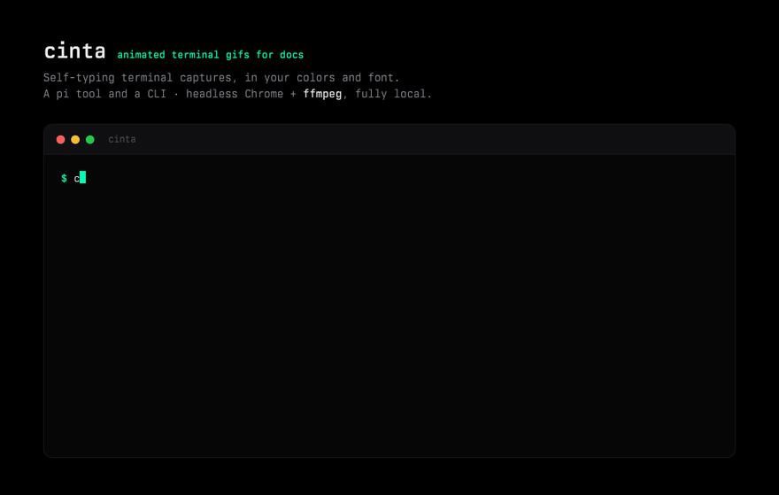

# cinta

[](https://www.npmjs.com/package/@ssainzs/cinta) [](https://github.com/sxnzs/cinta)

Animated terminal-capture GIFs for documentation — from inside pi, or from the
command line. You (or the agent) write a short terminal script; you get a
self-typing GIF in your colors and font.



## Install

As a pi extension:

```bash
pi install git:github.com/sxnzs/cinta   # latest
pi install npm:@ssainzs/cinta           # npm release (0.1.0 until 0.2.0 ships)
```

As a CLI, without pi:

```bash
npx github:sxnzs/cinta demo.json -o demo.gif
```

Requires Chrome (`brew install --cask google-chrome`, or set
`CINTA_CHROME_PATH`) and ffmpeg 5.1+ (`brew install ffmpeg`). No API keys, no
accounts — Chrome runs headless locally and the GIF never leaves your machine.

## Usage

In pi, ask in conversation:

```text
make a cinta GIF of the install command and the model list, save to assets/
```

or drive it directly:

```text
/cinta npm test passing, all tests green
```

From the shell, pass a script array — or an object with `script` plus any
option below:

```bash
cinta demo.json -o assets/demo.gif
echo '[{"type":"cmd","text":"ls"},{"type":"done"}]' | cinta - -o ls.gif
```

Every GIF gets a sibling `.html`: the regenerable source, which also plays the
animation live when opened in a browser.

## Script

| Step | Shape | Renders as |
|------|-------|------------|
| `cmd` | `{ "type": "cmd", "text": "npm test" }` | typed character-by-character after a `$` |
| `out` | `{ "type": "out", "text": "…", "cls": "ok" }` | one output block (`ok` = accent) |
| `stream` | `{ "type": "stream", "lines": ["…"] }` | lines appearing one at a time |
| `gap` | `{ "type": "gap" }` | vertical breathing room |
| `pause` | `{ "type": "pause", "ms": 800 }` | holds the current frame |
| `done` | `{ "type": "done" }` | final accent block + blinking cursor |

Output longer than the window scrolls, like a real terminal.

## Options

| Option | Default | |
|--------|---------|---|
| `name`, `tag`, `sub` | — | wordmark, accent tag, and subtitle lines (`<b>`/`<i>`/`<code>` allowed) above the window; omitted when empty |
| `title` | `name` | terminal window title |
| `width` × `height` | 1008 × 640 | capture viewport, px |
| `scale` | 880 | output GIF width, px |
| `fps` | 12 | capture rate |
| `font` | Berkeley Mono → `ui-monospace` → Menlo | CSS font stack |
| `colors` | black `#000000`, mint `#00ffb2` | `bg`, `panel`, `ink`, `dim`, `faint`, `accent`, `border`, `bar` |
| `timing` | 34 / 90 / 260 / 1600 | `typeMs`, `lineMs`, `afterCmdMs`, `endHoldMs` |

## How it works

The script becomes a timeline — a pure function from milliseconds to what the
terminal shows. Headless Chrome renders a styled HTML terminal (not a real one:
that is what makes it deterministic and stylable), and cinta seeks it to each
frame's exact time instead of recording in real time. Consecutive identical
frames merge into one longer GIF frame, and ffmpeg builds the GIF with a
single-pass palette. Pacing is exact to the centisecond, renders are
reproducible, and holds cost almost nothing in file size.

## Development

```bash
npm install
npm run verify   # typecheck, unit tests, and a real Chrome + ffmpeg render
```

The render tests skip themselves when Chrome or ffmpeg is missing. The hero
above is `node src/cli.mjs assets/hero.json -o assets/hero.gif`.

## License

MIT
